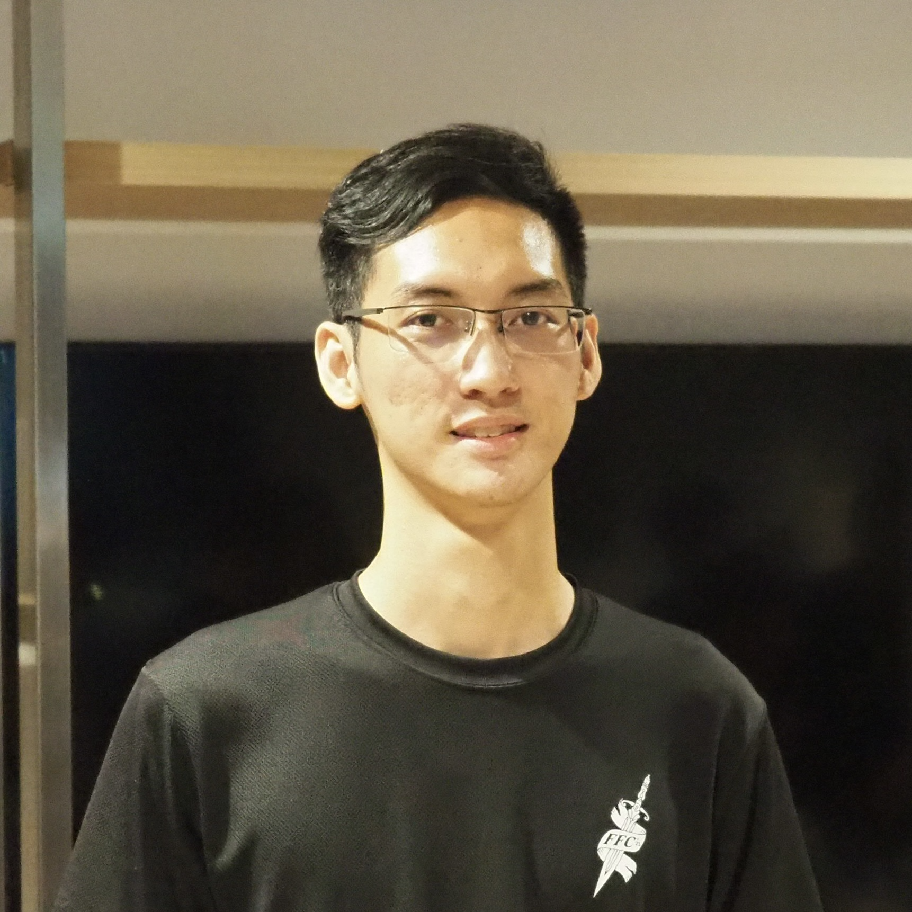
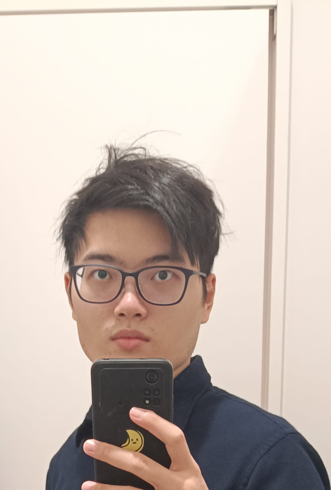

We are a team based in the [School of Computing, National University of Singapore](https://www.comp.nus.edu.sg).

You can reach us at the email `seer[at]comp.nus.edu.sg`

## Project team
### Kenneth Soh

[[homepage](http://kennethsoh.me)]
[[github](https://github.com/kennethsoh)]
[[portfolio](team/kennethsoh.md)]

* Role: Project Manager
* Responsibilites: Integration, Scheduling and Tracking

### Cheng Jing

[[homepage](https://cj-783.github.io/)]
[[github](https://github.com/CJ-783)]
[[portfolio](team/cj-783.md)]

* Role: Developer
* Responsibilities: Deadline and Code Quality

### Lee Chun Hao

[[homepage]](https://0x4F776C.github.io)
[[github](http://github.com/0x4F776C)]
[[portfolio](team/0x4F776C.md)]

* Role: Code Reviewer
* Responsibilities: Code Quality + Testing

### Ingyin San (Piper)

[[github](https://github.com/broccoli-hater)]

* Role: Developer

### Fadhil Peer Mohamed

[[github](http://github.com/FadhilPM)] [[portfolio](team/fadhilpm.md)]

* Role: Developer
* Responsibilities: Data

