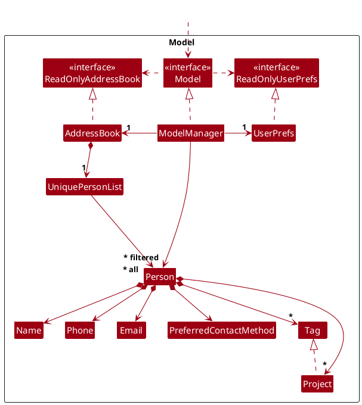
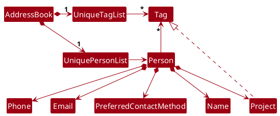
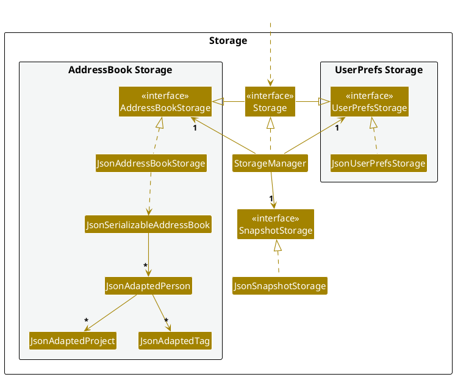

* Table of Contents
{:toc}

--------------------------------------------------------------------------------------------------------------------

## **Acknowledgements**

* This project is based on the AddressBook-Level3 project created by the [SE-EDU initiative](https://se-education.org).

--------------------------------------------------------------------------------------------------------------------

## **Setting up, getting started**

Refer to the guide [_Setting up and getting started_](SettingUp.md).

--------------------------------------------------------------------------------------------------------------------

## **Design**

:bulb: **Tip:** The `.puml` files used to create diagrams in this document `docs/diagrams` folder. Refer to the [_PlantUML Tutorial_ at se-edu/guides](https://se-education.org/guides/tutorials/plantUml.html) to learn how to create and edit diagrams.

### Architecture

The ***Architecture Diagram*** given above explains the high-level design of the App.

Given below is a quick overview of main components and how they interact with each other.

**Main components of the architecture**

**`Main`** (consisting of classes [`Main`](https://github.com/AY2425S2-CS2103-F10-1/tp/tree/master/src/main/java/seedu/address/Main.java) and [`MainApp`](https://github.com/AY2425S2-CS2103-F10-1/tp/tree/master/src/main/java/seedu/address/MainApp.java)) is in charge of the app launch and shut down.
* At app launch, it initializes the other components in the correct sequence, and connects them up with each other.
* At shut down, it shuts down the other components and invokes cleanup methods where necessary.

The bulk of the app's work is done by the following four components:

* [**`UI`**](#ui-component): The UI of the App.
* [**`Logic`**](#logic-component): The command executor.
* [**`Model`**](#model-component): Holds the data of the App in memory.
* [**`Storage`**](#storage-component): Reads data from, and writes data to, the hard disk.

[**`Commons`**](#common-classes) represents a collection of classes used by multiple other components.

**How the architecture components interact with each other**

The *Sequence Diagram* below shows how the components interact with each other for the scenario where the user issues the command `delete 1`.

Each of the four main components (also shown in the diagram above),

* defines its *API* in an `interface` with the same name as the Component.
* implements its functionality using a concrete `{Component Name}Manager` class (which follows the corresponding API `interface` mentioned in the previous point.

For example, the `Logic` component defines its API in the `Logic.java` interface and implements its functionality using the `LogicManager.java` class which follows the `Logic` interface. Other components interact with a given component through its interface rather than the concrete class (reason: to prevent outside component's being coupled to the implementation of a component), as illustrated in the (partial) class diagram below.

The sections below give more details of each component.

### UI component

The **API** of this component is specified in [`Ui.java`](https://github.com/AY2425S2-CS2103-F10-1/tp/tree/master/src/main/java/seedu/address/ui/Ui.java)

The UI consists of a `MainWindow` that is made up of parts e.g.`CommandBox`, `ResultDisplay`, `PersonListPanel`, `StatusBarFooter` etc. All these, including the `MainWindow`, inherit from the abstract `UiPart` class which captures the commonalities between classes that represent parts of the visible GUI.

The `UI` component uses the JavaFx UI framework. The layout of these UI parts are defined in matching `.fxml` files that are in the `src/main/resources/view` folder. For example, the layout of the [`MainWindow`](https://github.com/AY2425S2-CS2103-F10-1/tp/tree/master/src/main/java/seedu/address/ui/MainWindow.java) is specified in [`MainWindow.fxml`](https://github.com/AY2425S2-CS2103-F10-1/tp/tree/master/src/main/resources/view/MainWindow.fxml)

The `UI` component,

* executes user commands using the `Logic` component.
* listens for changes to `Model` data so that the UI can be updated with the modified data.
* keeps a reference to the `Logic` component, because the `UI` relies on the `Logic` to execute commands.
* depends on some classes in the `Model` component, as it displays `Person` object residing in the `Model`.

### Logic component

**API** : [`Logic.java`](https://github.com/AY2425S2-CS2103-F10-1/tp/tree/master/src/main/java/seedu/address/logic/Logic.java)

Here's a (partial) class diagram of the `Logic` component:

The sequence diagram below illustrates the interactions within the `Logic` component, taking `execute("delete 1")` API call as an example.

:information_source: **Note:** The lifeline for `DeleteCommandParser` should end at the destroy marker (X) but due to a limitation of PlantUML, the lifeline continues till the end of diagram.

How the `Logic` component works:

1. When `Logic` is called upon to execute a command, it is passed to an `AddressBookParser` object which in turn creates a parser that matches the command (e.g., `DeleteCommandParser`) and uses it to parse the command.
1. This results in a `Command` object (more precisely, an object of one of its subclasses e.g., `DeleteCommand`) which is executed by the `LogicManager`.
1. The command can communicate with the `Model` when it is executed (e.g. to delete a contact). 
   Note that although this is shown as a single step in the diagram above (for simplicity), in the code it can take several interactions (between the command object and the `Model`) to achieve.
1. The result of the command execution is encapsulated as a `CommandResult` object which is returned back from `Logic`.

Here are the other classes in `Logic` (omitted from the class diagram above) that are used for parsing a user command:

How the parsing works:
* When called upon to parse a user command, the `AddressBookParser` class creates an `XYZCommandParser` (`XYZ` is a placeholder for the specific command name e.g., `AddCommandParser`) which uses the other classes shown above to parse the user command and create a `XYZCommand` object (e.g., `AddCommand`) which the `AddressBookParser` returns back as a `Command` object.
* All `XYZCommandParser` classes (e.g., `AddCommandParser`, `DeleteCommandParser`, ...) inherit from the `Parser` interface so that they can be treated similarly where possible e.g, during testing.

### Model component
**API** : [`Model.java`](https://github.com/AY2425S2-CS2103-F10-1/tp/tree/master/src/main/java/seedu/address/model/Model.java)

The `Model` component,

* stores the address book data i.e., all `Person` objects (which are contained in a `UniquePersonList` object).
* stores the currently 'selected' `Person` objects (e.g., results of a search query) as a separate _filtered_ list which is exposed to outsiders as an unmodifiable `ObservableList<Person>` that can be 'observed' e.g. the UI can be bound to this list so that the UI automatically updates when the data in the list change.
* stores a `UserPref` object that represents the user’s preferences. This is exposed to the outside as a `ReadOnlyUserPref` objects.
* does not depend on any of the other three components (as the `Model` represents data entities of the domain, they should make sense on their own without depending on other components)

:information_source: **Note:** An alternative (arguably, a more OOP) model is given below. It has a `Tag` list in the `AddressBook`, which `Person` references. This allows `AddressBook` to only require one `Tag` object per unique tag, instead of each `Person` needing their own `Tag` objects. 

### Storage component

**API** : [`Storage.java`](https://github.com/AY2425S2-CS2103-F10-1/tp/tree/master/src/main/java/seedu/address/storage/Storage.java)

The `Storage` component,
* can save both address book data and user preference data in JSON format, and read them back into corresponding objects.
* inherits from both `AddressBookStorage` and `UserPrefStorage`, which means it can be treated as either one (if only the functionality of only one is needed).
* depends on some classes in the `Model` component (because the `Storage` component's job is to save/retrieve objects that belong to the `Model`)

### Common classes

Classes used by multiple components are in the `seedu.address.commons` package.

--------------------------------------------------------------------------------------------------------------------

## **Implementation**

This section describes some noteworthy details on how certain features are implemented.

### \[Proposed\] Undo/redo feature

#### Proposed Implementation

The proposed undo/redo mechanism is facilitated by `VersionedAddressBook`. It extends `AddressBook` with an undo/redo history, stored internally as an `addressBookStateList` and `currentStatePointer`. Additionally, it implements the following operations:

* `VersionedAddressBook#commit()` — Saves the current address book state in its history.
* `VersionedAddressBook#undo()` — Restores the previous address book state from its history.
* `VersionedAddressBook#redo()` — Restores a previously undone address book state from its history.

These operations are exposed in the `Model` interface as `Model#commitAddressBook()`, `Model#undoAddressBook()` and `Model#redoAddressBook()` respectively.

Given below is an example usage scenario and how the undo/redo mechanism behaves at each step.

Step 1. The user launches the application for the first time. The `VersionedAddressBook` will be initialized with the initial address book state, and the `currentStatePointer` pointing to that single address book state.

Step 2. The user executes `delete 5` command to delete the 5th contact in the address book. The `delete` command calls `Model#commitAddressBook()`, causing the modified state of the address book after the `delete 5` command executes to be saved in the `addressBookStateList`, and the `currentStatePointer` is shifted to the newly inserted address book state.

Step 3. The user executes `add n/David …​` to add a new contact. The `add` command also calls `Model#commitAddressBook()`, causing another modified address book state to be saved into the `addressBookStateList`.

:information_source: **Note:** If a command fails its execution, it will not call `Model#commitAddressBook()`, so the address book state will not be saved into the `addressBookStateList`.

Step 4. The user now decides that adding the contact was a mistake, and decides to undo that action by executing the `undo` command. The `undo` command will call `Model#undoAddressBook()`, which will shift the `currentStatePointer` once to the left, pointing it to the previous address book state, and restores the address book to that state.

:information_source: **Note:** If the `currentStatePointer` is at index 0, pointing to the initial AddressBook state, then there are no previous AddressBook states to restore. The `undo` command uses `Model#canUndoAddressBook()` to check if this is the case. If so, it will return an error to the user rather
than attempting to perform the undo.

The following sequence diagram shows how an undo operation goes through the `Logic` component:

:information_source: **Note:** The lifeline for `UndoCommand` should end at the destroy marker (X) but due to a limitation of PlantUML, the lifeline reaches the end of diagram.

Similarly, how an undo operation goes through the `Model` component is shown below:

The `redo` command does the opposite — it calls `Model#redoAddressBook()`, which shifts the `currentStatePointer` once to the right, pointing to the previously undone state, and restores the address book to that state.

:information_source: **Note:** If the `currentStatePointer` is at index `addressBookStateList.size() - 1`, pointing to the latest address book state, then there are no undone AddressBook states to restore. The `redo` command uses `Model#canRedoAddressBook()` to check if this is the case. If so, it will return an error to the user rather than attempting to perform the redo.

Step 5. The user then decides to execute the command `list`. Commands that do not modify the address book, such as `list`, will usually not call `Model#commitAddressBook()`, `Model#undoAddressBook()` or `Model#redoAddressBook()`. Thus, the `addressBookStateList` remains unchanged.

Step 6. The user executes `clear`, which calls `Model#commitAddressBook()`. Since the `currentStatePointer` is not pointing at the end of the `addressBookStateList`, all address book states after the `currentStatePointer` will be purged. Reason: It no longer makes sense to redo the `add n/David …​` command. This is the behavior that most modern desktop applications follow.

The following activity diagram summarizes what happens when a user executes a new command:

#### Design considerations:

**Aspect: How undo & redo executes:**

* **Alternative 1 (current choice):** Saves the entire address book.
  * Pros: Easy to implement.
  * Cons: May have performance issues in terms of memory usage.

* **Alternative 2:** Individual command knows how to undo/redo by
  itself.
  * Pros: Will use less memory (e.g. for `delete`, just save the contact being deleted).
  * Cons: We must ensure that the implementation of each individual command are correct.

--------------------------------------------------------------------------------------------------------------------

## **Documentation, logging, testing, configuration, dev-ops**

* [Documentation guide](Documentation.md)
* [Testing guide](Testing.md)
* [Logging guide](Logging.md)
* [Configuration guide](Configuration.md)
* [DevOps guide](DevOps.md)

--------------------------------------------------------------------------------------------------------------------

## **Appendix: Requirements**

### Product scope

**Target user profile**:

* Freelance Artists
* Has a need to manage a significant number of contacts with highly specific requests
* Prefer desktop apps over other types
* Can type fast
* Prefers typing to mouse interactions
* Is reasonably comfortable using CLI apps

**Value proposition**: organise client information clearly and efficiently, reminds users of upcoming deadlines and is optimised for users who prefer a command line interface.

### User stories

Priorities: High (must have) - `* * *`, Medium (nice to have) - `* *`, Low (unlikely to have) - `*`

| Priority | As a …​                | I want to …​                         | So that I can…​                                                       |
|----------|------------------------|--------------------------------------|-----------------------------------------------------------------------|
| `* * *`  | user                   | add a new contact                    |                                                                       |
| `* * *`  | user                   | delete a contact                     | remove entries that I no longer need                                  |
| `* * *`  | user with many clients | save my client's contacts            | keep track of all my clients's information                            |
| `* * *`  | user with many clients | track payments                       | check whether my clients have paid my commission                      |
| `* *`    | user                   | blacklist or tag clients             | identify unreasonable clients easily and not take more work from them |
| `* *`    | user with many clients | find contact by name or phone number | locate a contact easily                                                |

---
### Use cases

(For all use cases below, the **System** is `ArtHive` and the **Actor** is the `Artist`, unless specified otherwise)

**Use case: Add Contact**

**MSS**

1.  Artist wants to add a new contact.
2.  Artist enters the client’s Name, Phone Number, and optional Project Tag.
3.  ArtHive adds the contact and displays a success message.
    
    Use case ends.

**Extensions**

* 2a. ArtHive detects that the entered Phone Number is invalid.
  * 2a1. ArtHive displays an error message.

    Use case resumes at step 2.

* 2b. ArtHive detects that the client Name contains invalid characters or exceeds 40 characters.
  * 2b1. ArtHive displays an error message.

    Use case resumes at step 2.

* 2c. ArtHive detects that the entered Project Tag is invalid.
  * 2c1. ArtHive displays an error message.

    Use case resumes at step 2.

**Use case: Add a Tag/Project to Contact**

**MSS**

1.  Artist wants to add a Tag/Project to a Contact.
2.  Artist enters the contact's Phone Number and Tag/Project Name.
3.  ArtHive adds the Tag/Project Name to the Contact, and shows a success message.

    Use case ends.

**Extensions**

* 2a.   ArtHive detects that the given Phone Number is non-existent.
  * 2a1.  ArtHive displays an error message.

    Use case resumes at step 2.

* 2b.   ArtHive detects that the Project Name is non-existent.
  * 2b1.  ArtHive creates the Project with the following default statuses:
    * Payment: 'Unpaid'     
    * Deadline: One day after the creation of the project in a 'dd MMM uuuu HHmm' format
    * Progress: 'Incomplete'

    Use case resumes at step 3.

* 2c.   ArtHive detects that the Tag Name is non-existent.
    * 2c1.  ArtHive creates the Tag with the provided name.

      Use case resumes at step 3.
  
* 2d.   ArtHive detects that the user input is invalid.
  * 2d1.  ArtHive displays an error message.

    Use case resumes at step 2.

**Use case: Find Contact(s) by Name**

**MSS**

1.  Artist wants to Find Contact(s) from the list.
2.  Artist enters the client name(s) of the contact(s) they would like to find as the search input keyword(s).
3.  ArtHive returns a list of contacts whose Client Names match the search keyword(s).

    Use case ends.

**Extensions**

* 2a.   ArtHive detects that the user input is invalid.
  * 2a1.  ArtHive displays an error message.

    Use case resumes at step 2.

* 2b.   ArtHive is unable to find Client Names that match the search keyword(s).
  * 2b1.  ArtHive displays an empty list.

    Use case ends.

**Use case: Find Contact(s) by Phone Number**

**MSS**

1.  Artist wants to Find Contact(s) from the list.
2.  Artist enters the phone number(s) of the contact(s) they would like to find as the search input keyword(s).
3.  ArtHive returns a list of contacts whose Phone Numbers match the search keyword(s).

    Use case ends.

**Extensions**

* 2a.   ArtHive detects that the user input is invalid.
    * 2a1.  ArtHive displays an error message.

      Use case resumes at step 2.

* 2b.   ArtHive is unable to find Phone Numbers that match the search keyword(s).
    * 2b1.  ArtHive displays an empty list.

      Use case ends.

**Use case: Delete Contact**

**MSS**

1. Artist wants to delete a contact.
2. Artist enters the phone number or the index of the contact.
3. ArtHive deletes the contact and any associated project tags.
4. ArtHive displays confirmation of deletion.

   Use case ends.

**Extensions**

* 2a. ArtHive detects that the entered Phone Number is invalid.
  * 2a1. ArtHive displays an error message.
  * 2a2. Artist enters new data.

    Steps 2a1-2a2 are repeated until the data entered is correct.

    Use case resumes at step 3.
    
* 2b. ArtHive detects that the entered index is invalid.
  * 2b1. ArtHive displays an error message.
  * 2b2. Artist enters new data.
  
  Steps 2b1-2b2 are repeated until the data entered is correct.

**Use case: Clear Contact(s)**

**MSS**

1. Artist chooses to clear all contacts.
2. ArtHive clears all contacts and associated project tags.
3. ArtHive displays confirmation message.

   Use case ends.

**Use case: Save Contact(s)**

**MSS**

1. Artist wants to save contact(s).
2. ArtHive saves contact(s).
3. ArtHive displays confirmation message.

   Use case ends.

**Extensions**

* 1a. Artist specifies a filename consisting of recognised characters without an extension.
  * 1a1. ArtHive appends '.json' to the filename.
  * 1a2. ArtHive saves contact(s) based on the filename.

    Use case resumes at step 3.

* 1b. Artist does not specify a filename.
  * 1b1. ArtHive saves contact(s) to the default filename of 'arthive.json'.

    Use case resumes at step 3.

* 1c. Artist specifies an invalid filename consisting of unrecognised characters.
  * 1c1. ArtHive displays error message.
  * 1c2. Artist acknowledges the error.

    Use case returns to step 1.

* 2a. ArtHive encounters an error during saving.
  * 2a1. ArtHive displays an error message.
  * 2a2. Artist acknowledges the error.

    Use case ends.

**Use case: Update Project Status**

**MSS**

1.  Artist wants to update the status of a project.
2.  Artist enters the associated contact's display index, project name, and the fields they wish to update.
3.  ArtHive updates the corresponding contact’s project with the provided payment status, deadline or progress.

    Use case ends.

**Extensions**

* 2a.   ArtHive detects that the given Index is non-existent.
  * 2a1.  ArtHive displays an error message.

    Use case resumes at step 2.

* 2b.   ArtHive detects that the Project Name is non-existent.
  * 2b1.  ArtHive displays an error message.

    Use case resumes at step 2.

* 2c.   ArtHive detects that there are no fields provided to be updated.
    * 2c1.  ArtHive returns an error message.

      Use case resumes at step 2.
  
* 2d.   ArtHive detects that the user input is invalid.
  * 2d1.  ArtHive returns an error message.

    Use case resumes at step 2.

**Use Case: Toggle Preferred Contact Method between Email and Phone**

**MSS**

1. Artist wants to switch a Contact’s preferred contact method.
2. Artist enters the contact’s Phone Number.
3. ArtHive toggles the preferred contact method, and shows a success message.

Use case ends.

**Extensions**

* 2a. ArtHive detects that the given Phone Number is non-existent.
  * 2a1. ArtHive displays an error message.

    Use case resumes at step 2.

* 2b. The current preferred contact method is Phone, but no Email is recorded for the Contact.
  * 2b1. ArtHive displays an error message.
    
    Use case resumes at step 2.

* 2c. ArtHive detects that the user input is invalid. 
  * 2c1. ArtHive displays an error message.

    Use case resumes at step 2.

---

### Non-Functional Requirements

1. Should work on any _mainstream OS_ as long as it has Java `17` or above installed.
2. Should be able to hold up to 1000 contacts without a noticeable sluggishness in performance for typical usage.
3. A user with above average typing speed for regular English text (i.e. not code, not system admin commands) should be able to accomplish most of the tasks faster using commands than using the mouse.
4. The system should be able to respond within 3 seconds.
5. The system should not lose any data up till the latest successful operation due to accidental closure of the application.
6. The data file should be stored locally on the computer and should be in a human editable text file.
7. The software should be able to work without using an installer.
8. The software should not require a remote server to operate.

---

### Glossary

* **Alphanumeric**: Characters that consists of only letters (A-Z, a-z) and numbers (0-9).
* **Case Insensitive**: The property where uppercase and lowercase letters are treated as equivalent (e.g., "John Smith" vs "jOhn SmITh").
* **CLI**: Command Line Interface - the text-based method of interacting with ArtHive through integrated typed commands.
* **Client**: An individual or organization that engages the artist's services.
* **Command Format**: The specific syntax required to execute functions in ArtHive (e.g., "add n/<Client Name> p/<Phone Number> t/<ProjectTag Name>").
* **Contact**: An entry in ArtHive that contains client information, such as, name, phone number, and associated project tags.
* **Data Persistence**: The ability to save contact information to a file for later retrieval, ensuring data is not lost when the application is closed.
* **Deadline**: A date-time representation associated with a project that indicates when the project is due.
* **Domain (Email Domain)**: - The part of an email address after the "@" symbol that identifies the mail server handling emails, such as yahoo.com in user@yahoo.com.
* **Domain Label**: - A part of a domain name, separated by dots, such as www, example, and com in www.yahoo.com.
* **GUI** Graphical User Interface - the visual elements that display information and receive user input.
* **JAR**: - JAR stands for Java ARchive. It is a format based on the widely used ZIP file structure, designed to bundle multiple files into one.
* **JSON File**: The file format used to store contact information (arthive.json).
* **Mainstream OS**: Windows, Linux, Unix, MacOS.
* **Parameter**: A piece of information required by a command, such as client name, phone number, or project tag.
* **Payment**: A boolean attribute (paid/unpaid) associated with a project that indicates whether payment has been received.
* **Phone Number**: A unique 8-digit Singapore phone number starting with '6','8', or '9' that acts as the unique and primary identifier for each contact in ArtHive.
* **Progress**: A boolean attribute (complete/incomplete) associated with a project that indicates whether the project is completed or not.
* **Project**: A task or commission that the artist is currently working on or has completed for a client (contact). Each project is associated with a specific contact and includes key details such as payment status, deadline and progress. Project names are alphanumeric strings with underscores and hyphens, up to 20 characters.
* **Regex**: Regular Expression - a sequence of characters that defines a certain search pattern, used in ArtHive to validate phone numbers.
* **Tag**: A short descriptive label used to categorize or highlight specific contacts or projects. Tags are alphanumeric strings with underscores and hyphens, up to 20 characters.
* **Top-Level Domain** - The first stop after the root zone, basically everything that is after the final dot of a domain name, such as the 'com' of 'youtube.com'
* **Trim**: The process of removing leading and trailing spaces from input.

--------------------------------------------------------------------------------------------------------------------

## **Appendix: Instructions for manual testing**

Given below are instructions to test the app manually.

:information_source: **Note:** These instructions only provide a starting point for testers to work on;
testers are expected to do more *exploratory* testing.

### Launch and shutdown

1. Initial launch

   1. Download the jar file and copy into an empty folder

   1. Double-click the jar file 
   Expected: Shows the GUI with a set of sample contacts. The window size may not be optimal.

1. Saving window preferences

   1. Resize the window to an optimum size. Move the window to a different location. Close the window.

   1. Re-launch the app by double-clicking the jar file. 
       Expected: The most recent window size and location is retained.
       
### Adding a contact

1. Adding a contact with required fields only.

   1. Test case: `add n/John Doe p/91234567` 
      Expected: Contact named "John Doe" is added to the contact list with the specified phone number. Details of added contact shown in status message. 
      
1. Adding a contact with optional fields. 

   1. Test case: `add n/Jane Doe p/93214567 e/jane@example.com t/client proj/website-design` 
      Expected: Contact named "Jane Doe" is added to the contact list with the specified parameters.
      Details of added contact shown in status message.
      
### Tagging a contact

1. Adding tags and projects to a contact. 

    1. Prerequisites: At least one contact in the list
    
    1. Test case: `tag p/87438807 t/client proj/logo-design` (assuming a contact with this phone number exists)  
       Expected: The tag "client" and project "logo-design" are added to the contact with phone number "87438807". Success message is shown. 
       
### Untagging a contact

1. Removing tags and/or projects from a contact.

    1. Prerequisites: At least one contact with tags or projects.
    
    1. Test case: `untag p/87438807 t/client proj/logo-design` (assuming a contact with this phone number and tag exists)  
       Expected: The tag "client" and the project "logo-design" are removed from the contact with phone number "87438807". Success message is shown in the status message.

### Setting project status
1. Setting the status of a project assigned to a contact. 

    1. Prerequisites: At least one contact with a project. 
    
    1. Test case: `setstatus 1 proj/mobile-app pay/paid prog/complete` (assuming the first contact has a project named "mobile-app") 
       Expected: The project "mobile-app" for the first contact is updated with payment status "Paid" and     
      progress status "Complete". Success message is shown
      
### Switching preferred contact method  

1. Switching the preferred contact method of a client from "Phone" to "Email"

    1. Prerequisites: At least one contact in the list with an email address.
    
    1. Test case: `switchcontact p/87438807` (assuming a contact with this phone number exists and has an email address)  Expected: The preferred contact method for the contact with phone number "87438807" will have their preferred contact method switched from "Phone" to "Email" or vice versa. 

### Deleting a contact

1. Deleting a contact while all contacts are being shown

   1. Prerequisites: List all contacts using the `list` command. Multiple contacts in the list.

   1. Test case: `delete 1` 
      Expected: First contact is deleted from the list. Details of the deleted contact shown in the status message.

   1. Test case: `delete 0` 
      Expected: No contact is deleted. Error details shown in the status message. 

   1. Other incorrect delete commands to try: `delete`, `delete x`, `...` (where x is larger than the list size) 
      Expected: Similar to previous.

### Save data

1. Saving data without parameters

   1. Key in `save` in the command space.

   1. Locate and enter `/data` directory through file browser or command-line interface. 
    **Note**: `/data` should be in the same directory as ArtHive.

   1. There should only be one file in `/data` called `arthive.json`.

1. Saving data with parameters

   1. Key in `save <filename>` in the command space.

   1. Locate and enter `/data` directory through file browser or command-line interface. 
    **Note**: `/data` should be in the same directory as ArtHive.

   1. There should only be one file in `/data` with the same name as `<filename>`.

### Snapshot

1. Creating a snapshot of the existing data

   1. Key in `snapshot` in the command space.

   1. Locate and enter `/snapshot` directory through file browser or command-line interface. 
    **Note**: `/snapshot` should be in the same directory as ArtHive.

   1. There should be a new file in `/snapshot` with the name consisting of `datetime` in the format of `dMMMuuuu_HHmmss`.  

--------------------------------------------------------------------------------------------------------------------

## **Appendix: Planned Enhancements**

This team consists of 5 members. 

### 1. Improve Deadline Validation                                                                                                                                                                                                       

ArtHive currently does not prevent users from setting project deadlines to past dates, potentially causing confusion. We plan to enhance the `setstatus` command to display an error message when users attempt to set a deadline in the past, serving as a sanity check.

### 2. Highlight Overdue Projects                                                                                                                                                                                                            

ArtHive does not highlight overdue deadlines in the user interface. This makes it impossible for users to tell at a single glance if any projects are overdue. We plan to rectify this by enhancing the user interface to highlight projects that are currently overdue by comparing deadlines to the system time. One possible solution would be to highlight overdue projects in red to signal the need for immediate attention to the user.

### 3. Flexible Date Parsing                                                                                                                                                                                                                    

ArtHive's `setstatus` command currently accepts only one date input format and enforces English-language dates, which may be overly rigid for potential users. We plan to improve ease-of-use by enhancing the setstatus command to accept multiple date formats and natural language inputs. Additionally, we plan to enhance the display of dates in the user interface to conform to the current system locale, to provide users a more native feeling experience.  

### 4. Add Project Description Field                                                                                                                                                                                                                

Projects in ArtHive are currently unable to store descriptions. This may hinder users when attempting to identify a project, especially when multiple clients have similarly named projects. We plan to add a description parameter to the `tag` command, store this information in project details, and display this information in the user interface. Descriptions will also naturally be editable via the `setstatus` command.

### 5. Add Explicit Duplicate Tag/Project Warnings                                                                                                                                                                                                       

When users attempt to add tags/projects to a contact that already has a tag/project by that name, ArtHive does not make any changes to the contact, but crucially does not notify the user of this, which may result in confusion. We plan to rectify this by enhancing the `tag` command to detect duplicates and display a specific error message, rather than silently rejecting the command.

### 6. Improve Search Capabilities                                                                                                                                                                                                             

ArtHive's `find` command only accepts name or phone parameters. This may be overly restrictive to users, especially if they might be attempting to access a client’s contact details via a project name.  We plan to enhance the `find` command to support searching for contacts by project status, deadline range, or payment status.

### 7. Add Mass Operations Support                                                                                                                                                                                                                  

With the exception of `clear`, ArtHive commands operate on one contact at a time. This may slow down a user attempting to manage a large pool of clients. To remedy this, we plan to modify commands to be able to perform actions on multiple contacts simultaneously, such as `tag multiple/1,2,3 t/urgent` to tag contacts at indexes 1, 2, and 3

### 8. Reduce Command Verbosity

ArtHive's `setstatus` command utilizes overly verbose wording for parameters that are effectively booleans which reduces ease of use as users have to recall specific keywords. For instance, `setstatus 1 proj/logo-design pay/paid by/15 Apr 2025 2359 prog/complete` might be better represented as `setstatus 1 proj/logo-design paid/y by/15 Apr 2025 2359 done/y`. We plan to rectify this by transitioning to a simpler syntax for `setstatus`, utilizing y/n to represent the payment and completion status of projects. 

### 9. Expand Phone Number Support Beyond Singapore 

ArtHive current only accepts Singaporean phone numbers—specifically 8-digit numbers that begin with 3, 6, or 9. To better support users with international contacts, we plan to enhance ArtHive to accept phone numbers from other countries. These enhancements include specific handling of international/area dialing codes and validating formats according to each country’s standards.

### 10. Allowing Names in Multiple Languages

ArtHive currently only supports names using alphanumeric characters and a limited set of special characters. To better accommodate an international audience, we plan to support names in different languages and scripts (e.g., Chinese, Arabic, Tamil). This would allow users to input names in their native form, improving inclusivity and user experience across diverse regions.
